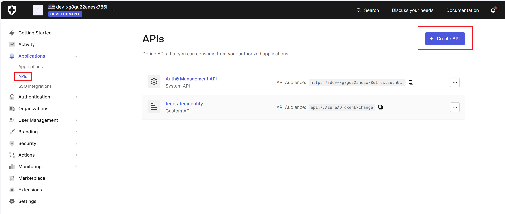
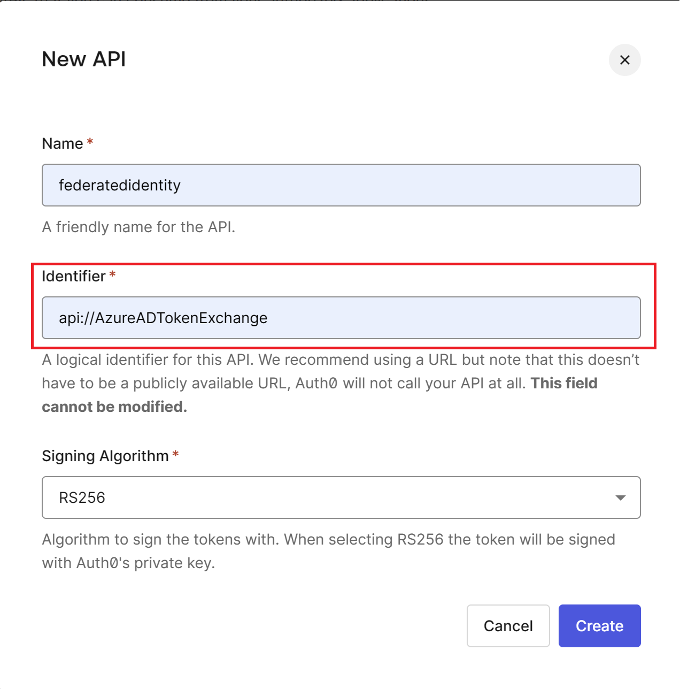
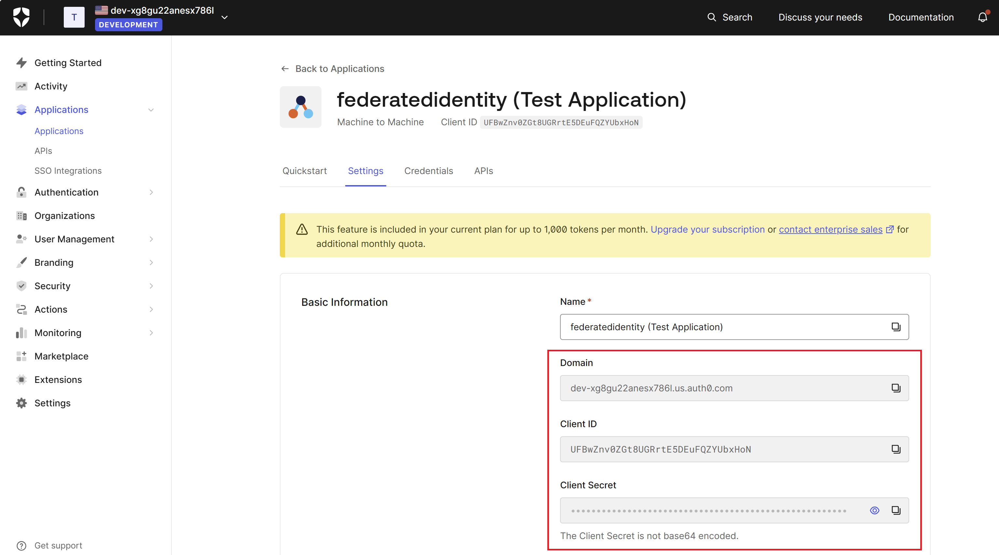
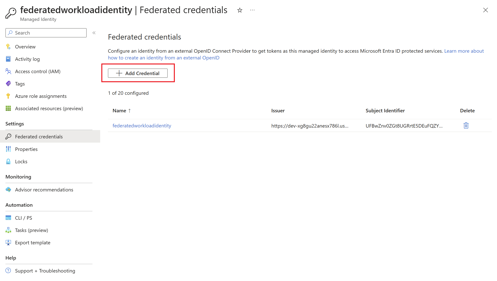
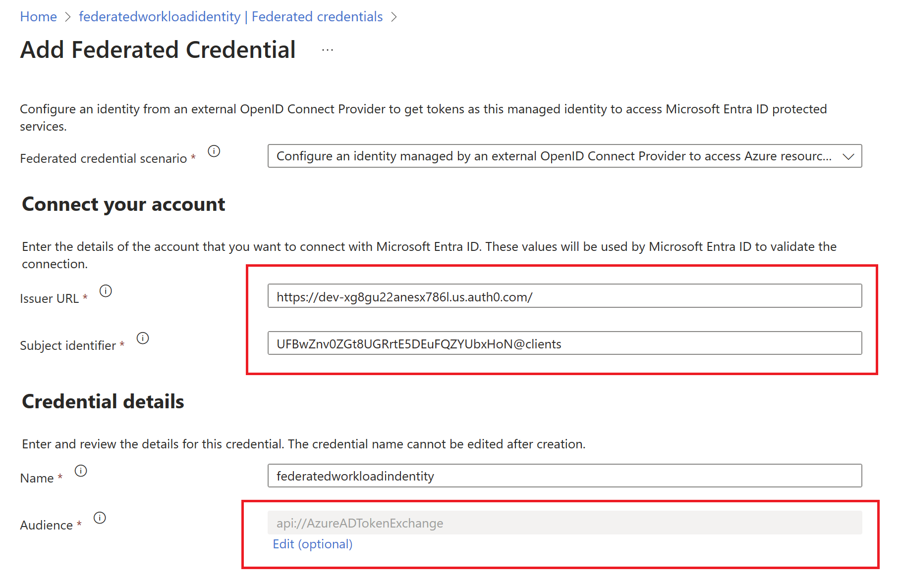

# Workload Identity for Azure OpenAI and Auth0

This repo will help you to use a Workload Identity to connect to Azure OpenAI with an identity in Auth0.

An API/identity (clientID/clientSecret) is created in an Auth0 domain. This identity is used to authenticate to Auth0 and retrieve an acces_token.
This token is used to authenticate to Azure Entra ID with a binding on a User Managed Identity (Federated Credentials)

## Auth0

You can signup to a free account on [Auth0](https://auth0.com/)

1. Create an API :

2. Use **api://AzureADTokenExchange** in the Audience

3. Retrieve and keep those informations :
  - Domain
  - Client ID
  - Client Secret

## Managed Identity

1. Create a User Managed Identity and add a Federated credential

2. Configure the Federated Credentials

- Issuer URL : https:// + Auth0 Domain  
- Subject Identifier : Auth0 Client ID + **@clients**  
- Name : The name you want

## Pre-requisites

- One Azure OpenAI instance with a model deployed
- The User Managed Identity must have the role *Cognitive Services OpenAI User*

## Python

- You need to install all the package in the requirements file
  - `pip install requirements.txt`
- Rename the **.env-sample** file to **.env**
- Fill all the values
- Run the code
  - `python aoai.py`

## Deployment parameters

| Parameter | Value | Note |
| --- | --- | ------------- |
|OIDC_ENDPOINT||Auth0 domain (without https)|
|OIDC_CLIENT_ID||Auth0 clientID| 
|OIDC_CLIENT_SECRET||Auth0 client Secret|
|AZURE_TENANT_ID||ID of your Entra ID tenant|
|AZURE_CLIENT_ID||ClientID of the User Managed Identity|
|AZURE_AOAI_ENDPOINT||Endpoint of the Azure OpenAI resource (with https)|

### POST Manual actions

1. You need to approve the Shared Private Access Link on the storage account for AI Search service
2. You need to add the **Storage Blob Data Reader** Role to the System Managed Identity of your Document Intelligence service on the Storage Account
3. Please add an Identity Provider for the 2 webapps (webapp and adminwebapp)
